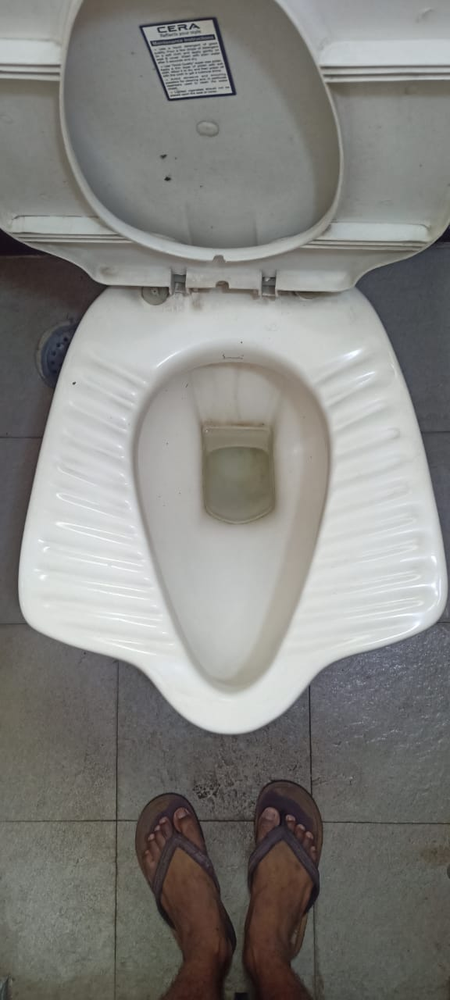
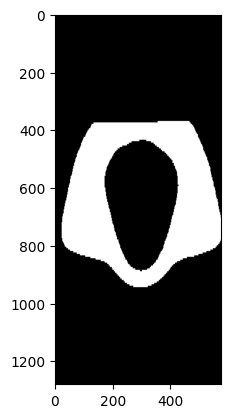
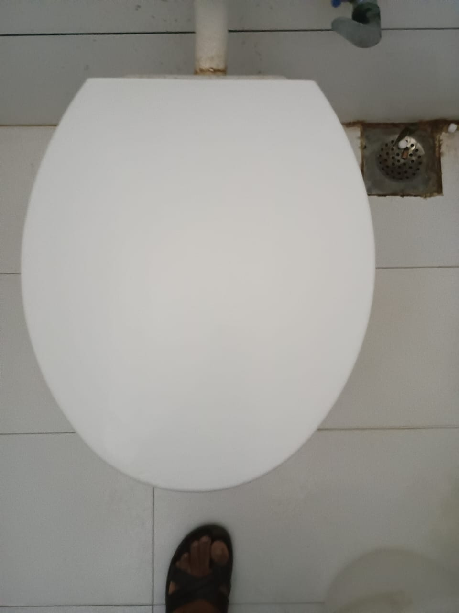
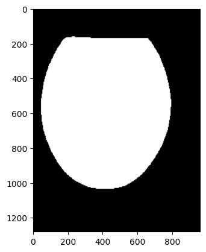
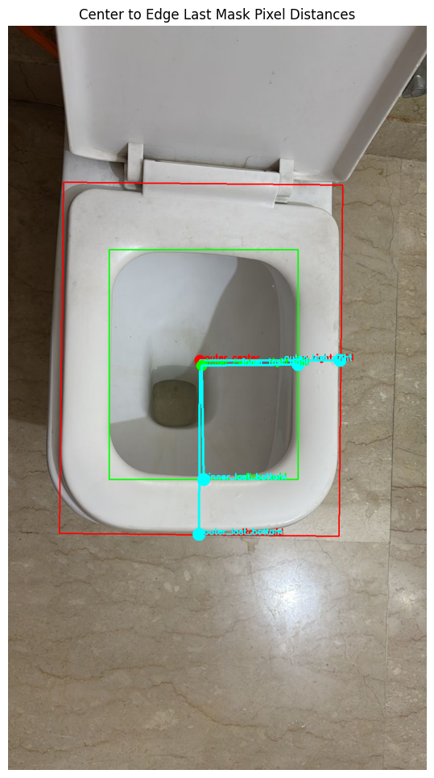

# Toilet Rim Segmentation Model

This project features a deep learning model for toilet rim detection and measurement. It is designed for applications in smart bathrooms, robotic cleaning, home automation, and object-aware sanitation devices.

## How to run the code

To input an image of your own and check if it works or not:
download and run the file named: visualize_mask.py (NOTE: make sure to put the correct image path.)
It will predict the mask on the given toilet image and print the masked image to visualize the rim created.

## Features

The model offers the following key functionalities:

* **Rim Detection (Open Toilet)**: Segments both the inner and outer toilet rims as distinct ring-like structures.
* **Lid Detection (Closed Toilet)**: Identifies the full lid as a single object when the toilet is closed.
* **Distance Measurements**: Computes distances from the center of the toilet to the midpoint of the bottom edge and the midpoint of the right edge, for both the inner and outer rims.
* **Robustness**: Handles various toilet shapes (round, oval, square) and different lighting conditions effectively.
* **Fine-tuning**: Can be fine-tuned using images with red markings.

## Model Overview

This is a semantic segmentation model built using deep learning techniques (e.g., UNet or Segmentation Models). It has been fine-tuned on toilet datasets that were manually marked with red overlays.

## Visual Examples

### Open Toilet – Inner and Outer Rim Segmentation

**Raw Image**



**Predicted Mask**



### Closed Toilet – Lid Detection

**Raw Image**



**Predicted Mask**



### Distance Measurement Output

**Visual Output**



**Measured Distances:**
* **Outer Center**: (412, 719) 
    * Distance to Last Bottom Pixel: 374.01 
    * Distance to Last Right Pixel: 301.00 
* **Inner Center**: (416, 730) 
    * Distance to Last Bottom Pixel: 245.03 
    * Distance to Last Right Pixel: 207.01 

## Technical Details

* **Framework**: PyTorch 
* **Model Type**: UNet / DeepLabV3+ / Custom Encoder 
* **Input Size**: 256x256 (internally resized) 
* **Output**: Binary mask 
* **Inference Speed**: Approximately 20ms per image (on GPU) 
* **Distance Logic**: Utilizes `cv2.minAreaRect` and directional scanning 

## Training Notes

The model was initially trained on a combination of synthetic and real toilet image datasets. These datasets featured clear rim/lid boundaries and red elliptical markings for fine-tuning. The final fine-tuning process involved manually annotated red-marked masks.

Strict HSV thresholds are employed for red mask extraction:
```python
lower_red1 = np.array([0, 150, 150])
upper_red1 = np.array([5, 255, 255])
lower_red2 = np.array([175, 150, 150])
upper_red2 = np.array([180, 255, 255])
````

## Author

**Heet Savaliya**
B.Tech Computer Engineering
Pandit Deendayal Energy University

  * **LinkedIn**: [https://www.linkedin.com/in/heet-savaliya-03b863252/](https://www.google.com/search?q=https://www.linkedin.com/in/heet-savaliya-03b863252/)
  * **Email**: savaliyaheet19@gmail.com

## License

This project is released under the [MIT License](https://opensource.org/licenses/MIT). You are free to use, modify, and build upon this work.
